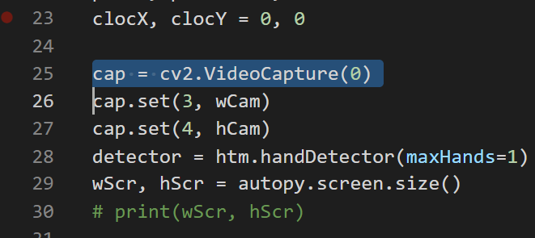
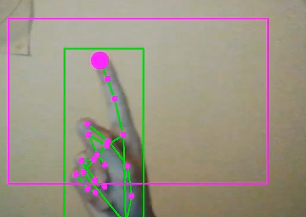

# Hand Tracking

Hey!


Voici le code que j'ai fait qui vous permet de détectez votre main et de faire des actions tel que le mouvement de la souris, les cliques de la souris et autres !

Vous devrez changer de camera si au lancement il y a un ecran noir 

## changement de la camera

Pour changer de camera vous n'avez qu'a juste aller dans code.py a la ligne **25** ```cap = cv2.VideoCapture(0)``` changer le "0" par 1,2,3,... 
[]

## image & video
 
[]

[video demo(youtube)](https://youtu.be/y3vFMNqe-9g)

## Contact
 Discord:`</>#9020`

## Module utilisé
Les modules qui ont été utilisé pour faire se code sont:

 * [mediapipe]( https://google.github.io/mediapipe/getting_started/python) 0.8.3.1	0.8.7.2 


 * [opencv-contrib-python](https://pypi.org/project/opencv-contrib-python/) 4.5.3.56	4.5.3.56 


 * opencv-python 4.5.1.48	4.5.3.56


 * [mouse](https://pypi.org/project/mouse/) 0.7.1	0.7.1


 * [cvzone]( https://github.com/cvzone/cvzone)	1.1	1.5.1


 * [autopy](https://www.autopy.org/) 4.0.0	4.0.0


 * [numpy](https://numpy.org/) 1.21.0	1.21.2